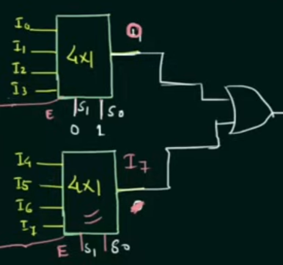
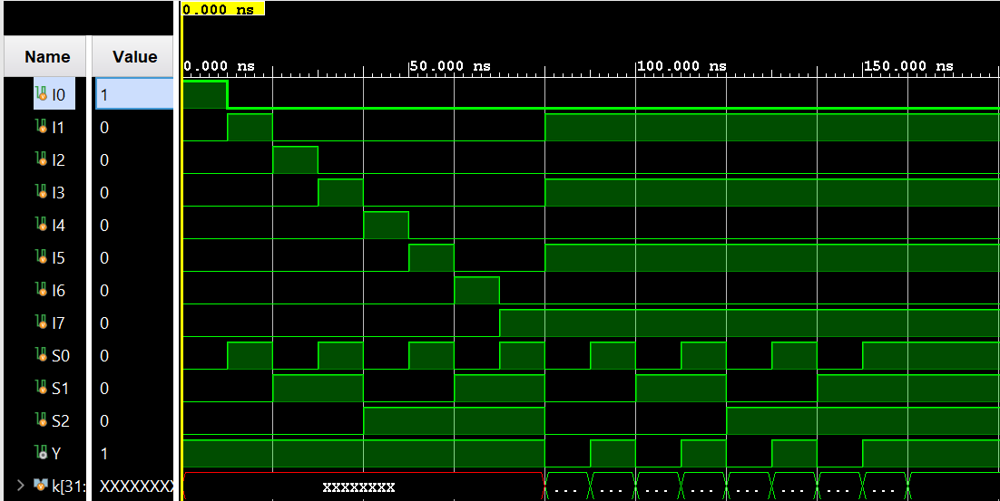

# 8:1 Multiplexer Using 4:1 Multiplexers | Verilog

A **Verilog implementation of an 8:1 multiplexer (MUX) using 4:1 MUX blocks**, designed and simulated using the Vivado IDE. This document explains what a **multiplexer** is, how **MUX hierarchies** can be used to construct larger multiplexers from smaller ones, the **Boolean behavior of an 8:1 MUX**, and how it can be implemented using **two 4:1 MUXes with enable control**.

The project includes the **RTL design**, **testbench**, **simulation waveform**, and **console output** verifying correct behavior.

---

# Table of Contents

- [What Is a Multiplexer?](#what-is-a-multiplexer)
- [8:1 Multiplexer Truth Table and Behavior](#81-multiplexer-truth-table-and-behavior)
- [Boolean Equation](#boolean-equation)
- [Implementing an 8:1 MUX Using 4:1 MUX Blocks](#implementing-an-81-mux-using-41-mux-blocks)
- [Learning Resources](#learning-resources)
- [Circuit Diagram](#circuit-diagram)
- [Waveform Diagram](#waveform-diagram)
- [Testbench Output](#testbench-output)
- [Running the Project in Vivado](#running-the-project-in-vivado)
- [Project Files](#project-files)

---

# What Is a Multiplexer?

A **multiplexer (MUX)** is a combinational logic circuit that selects **one of several input signals** and forwards the selected input to a **single output line**.

The selection is controlled by **select signals (selector lines)**.

For a multiplexer:

- **n** = number of inputs  
- **m** = number of select lines  

They follow the relationship:

```
n = 2^m
```

Examples:

| MUX Type | Inputs | Select Lines |
|---------|--------|--------------|
| 2:1 MUX | 2 | 1 |
| 4:1 MUX | 4 | 2 |
| 8:1 MUX | 8 | 3 |

---

# 8:1 Multiplexer Truth Table and Behavior

An **8:1 multiplexer** has:

### Inputs

- **I0, I1, I2, I3, I4, I5, I6, I7**

### Select Lines

- **S2, S1, S0**

### Output

- **Y**

The select signals form a **3-bit binary number** that determines which input appears at the output.

| S2 | S1 | S0 | Y |
|---|---|---|---|
|0|0|0|I0|
|0|0|1|I1|
|0|1|0|I2|
|0|1|1|I3|
|1|0|0|I4|
|1|0|1|I5|
|1|1|0|I6|
|1|1|1|I7|

Interpretation:

| Select Value | Output |
|---|---|
|000|Y = I0|
|001|Y = I1|
|010|Y = I2|
|011|Y = I3|
|100|Y = I4|
|101|Y = I5|
|110|Y = I6|
|111|Y = I7|

Thus, the select signals **route exactly one input to the output**.

---

# Boolean Equation

The Boolean equation describing an **8:1 multiplexer** is:

```
Y =
(~S2 & ~S1 & ~S0 & I0) |
(~S2 & ~S1 &  S0 & I1) |
(~S2 &  S1 & ~S0 & I2) |
(~S2 &  S1 &  S0 & I3) |
( S2 & ~S1 & ~S0 & I4) |
( S2 & ~S1 &  S0 & I5) |
( S2 &  S1 & ~S0 & I6) |
( S2 &  S1 &  S0 & I7)
```

Where:

- **&** represents **AND**
- **|** represents **OR**
- **~** represents **NOT**

Each product term corresponds to one row of the truth table.

---

# Implementing an 8:1 MUX Using 4:1 MUX Blocks

This design implements an **8:1 multiplexer using two 4:1 multiplexers**.

## Step 1 — Input Grouping

The eight inputs are divided into two groups:

| 4:1 MUX | Inputs |
|---|---|
|MUX1|I0, I1, I2, I3|
|MUX2|I4, I5, I6, I7|

Both multiplexers share the **same select lines S1 and S0**.

---

## Step 2 — Enable Control

The third select signal **S2** determines which 4:1 MUX is active.

| Signal | Function |
|---|---|
|Enable1 = ~S2 | activates MUX1 |
|Enable2 = S2 | activates MUX2 |

This ensures:

- When **S2 = 0**, only the first MUX is enabled.
- When **S2 = 1**, only the second MUX is enabled.

---

## Step 3 — Output Combination

The outputs of the two multiplexers are combined using an **OR gate**.

```
Y = out1 | out2
```

This works because **only one MUX is enabled at a time**.

An **AND gate cannot be used**, because the disabled MUX output would force the final output to **0**.

---

# Circuit Diagram

The circuit consists of:

- Two **4:1 multiplexers**
- **Enable logic using S2**
- **One OR gate**

```
        S2
      ┌─────┐
      │     │
 ┌───────────────┐
 │               │
┌───────┐   ┌───────┐
│4:1MUX │   │4:1MUX │
│I0-I3  │   │I4-I7  │
└───────┘   └───────┘
     │           │
     └─────OR────┘
           │
           Y


```

---

# Waveform Diagram

The waveform simulation verifies correct functionality by:

1. Setting one input to **1** while others are **0**.
2. Sweeping through all select values.
3. Confirming the output equals the selected input.

```
Signals Observed:
S2 S1 S0
I0 I1 I2 I3 I4 I5 I6 I7
Y


```

---

# Testbench Output

Simulation console output:

```
S=000 | Y=1
S=001 | Y=1
S=010 | Y=1
S=011 | Y=1
S=100 | Y=1
S=101 | Y=1
S=110 | Y=1
S=111 | Y=1
S=000 | Y=0
S=001 | Y=1
S=010 | Y=0
S=011 | Y=1
S=100 | Y=0
S=101 | Y=1
S=110 | Y=0
S=111 | Y=1
```

These results confirm that **Y always matches the selected input**.

---

# Running the Project in Vivado

## 1. Launch Vivado

Open **Xilinx Vivado**.

## 2. Create a New Project

- Click **Create Project**
- Select **RTL Project**

## 3. Add Files

Design Sources:

```
fourToOneMultiplexer.v
eightOneMUXTree.v
```

Simulation Sources:

```
eightOneMUXTree_tb.v
```

Set the **testbench as the simulation top module**.

---

## 4. Run Simulation

Click:

```
Run Behavioral Simulation
```

Observe signals:

```
S2 S1 S0
I0–I7
Y
```

Verify that **Y matches the selected input**.

---

# Project Files

| File | Description |
|-----|-------------|
| `fourToOneMultiplexer.v` | 4:1 multiplexer with enable input |
| `eightOneMUXTree.v` | 8:1 multiplexer implemented using two 4:1 MUX blocks |
| `eightOneMUXTree_tb.v` | Testbench verifying correct functionality |

---

Author: **Kadhir Ponnambalam**
